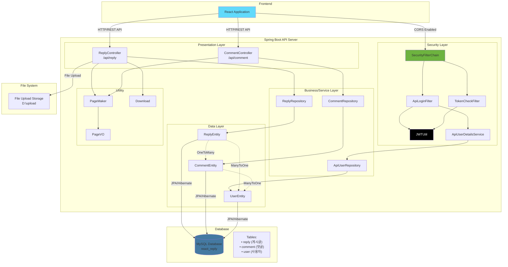

# React Reply 프로젝트 아키텍처

## 아키텍처 다이어그램



## 프로젝트 아키텍처 설명

이 프로젝트는 **React + Spring Boot** 기반의 **댓글/답변 게시판 시스템**입니다.

### 🏗️ 아키텍처 구성

#### 1. Frontend Layer
- **React Application**: 클라이언트 측 UI

#### 2. Backend - Spring Boot API Server

**📡 Presentation Layer (Controller)**
- `ReplyController`: 게시글 CRUD, 파일 업로드/다운로드
- `CommentController`: 댓글 CRUD

**🛡️ Security Layer**
- `SecurityFilterChain`: Spring Security 설정
- `JWTUtil`: JWT 토큰 생성/검증
- `ApiLoginFilter`: 로그인 필터
- `TokenCheckFilter`: 토큰 검증 필터
- `ApiUserDetailsService`: 사용자 인증 서비스

**💼 Business/Repository Layer**
- `ReplyRepository`: 게시글 데이터 접근
- `CommentRepository`: 댓글 데이터 접근
- `ApiUserRepository`: 사용자 데이터 접근

**📊 Data Layer (Entity)**
- `ReplyEntity`: 게시글 엔티티
- `CommentEntity`: 댓글 엔티티
- `UserEntity`: 사용자 엔티티

**🔧 Utility**
- `PageMaker`/`PageVO`: 페이징 처리
- `Download`: 파일 다운로드 유틸

#### 3. Data Storage
- **MySQL Database**: 메인 데이터 저장소
  - `reply` 테이블: 게시글
  - `comment` 테이블: 댓글
  - `user` 테이블: 사용자
- **File System**: 업로드 파일 저장 (`D:\upload`)

### 🔗 주요 특징
- **RESTful API** 설계
- **JWT 기반 인증**
- **JPA/Hibernate** ORM
- **파일 업로드/다운로드** 지원
- **페이징 처리**
- **CORS 지원** (React 연동)
- **계층형 댓글** 구조 (parent_no 관계)

### 📋 데이터 관계
- User (1) : Reply (N)
- User (1) : Comment (N)  
- Reply (1) : Comment (N)

### 🛠️ 기술 스택

#### Backend
- **Framework**: Spring Boot 3.3.1
- **Security**: Spring Security + JWT
- **Database**: MySQL
- **ORM**: JPA/Hibernate
- **Build Tool**: Gradle
- **Java Version**: 17

#### Frontend
- **Framework**: React
- **Communication**: REST API (HTTP)

### 📁 프로젝트 구조

```
src/
├── main/
│   ├── java/
│   │   └── react/
│   │       └── reply/
│   │           ├── ReactReplyApplication.java
│   │           ├── comment/          # 댓글 관련
│   │           ├── reply/            # 게시글 관련
│   │           ├── security/         # 보안 관련
│   │           ├── user/            # 사용자 관련
│   │           └── util/            # 유틸리티
│   └── resources/
│       └── application.properties
└── test/
    └── java/
        └── react/
            └── reply/
                ├── ReactReplyApplicationTests.java
                ├── ReplyTest.java
                └── security/
                    └── JwtTest.java
```

이 아키텍처는 모던한 웹 애플리케이션의 표준적인 3-tier 구조를 따르고 있으며, 보안과 확장성을 고려한 설계입니다.
